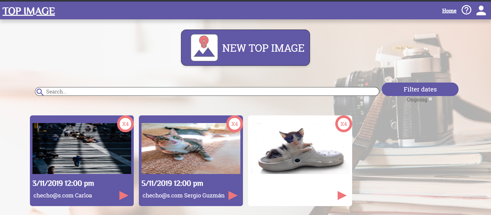

# TopImage

App which allows people to create design constests and search for previous winners

## Data Model

Two main data models: Users and Contests

```
Users: {
    "_id":Mongo default,
    "username":String,
    "password":String,
    "contests":Contest[] //Yes?
}
```

```
Contests: {
    "_id":Mongo default,
    "name":String,
    "topic":String,
    "username":String,
    "endDate":Date,
    "images":Image[]
}
```

When making a request, the expected image format has "data" in it ;)

```
Images:{
    "_id":Mongo default,
    "url":String,
    "likedBy":Array of Usernames,
    "likes":Number
}
```

# Academical-reborn

This app allows people to plan their schedule based on custom events and cultural events offered by the Los Andes University.

## Colaborators

- Carlos Mario Sarmiento: Alias "El Korkies"

  [Personal Site](https://korkies22.github.io/Portfolio/) - [GitHub](https://github.com/korkies22/)

- Sergio Guzmán Mayorga: Alias "El Checho"

  [Personal Site](https://sguzmanm.github.io/i-am-sergio-guzman/) - [GitHub](https://github.com/sguzmanm)

## Links

**Deployed at:** https://protected-inlet-87189.herokuapp.com/

## Description

With Academical Reborn people from the Los Andes University can get to know which events the university offers and plan them into their schedule.
The person must register in the system. Later, that user can create schedules and for each schedules he/she can add events.
The events are composed by a name, description and a date. The events are shown in the calendar by hovering and added by clicking on them. If the event crosses with one another, the hovered event shows a red background.
The person can switch between weeks to be able to see which events he/she has included. He can also switch between schedules to be able to see the events in each of them.

## Objective

We want to allow people to be able to know which cultural events the university offers, and plan them within their schedule.

## Tecnologies used

This project was developed using the MERN stack.

- **Mongo DB**: MongoDB was used as a NOSQL database. Here users,schedules and events are stored.
- **Express**: A fast, minimalistic and flexible framework for Node.js, it allows route handling in an easy way. https://expressjs.com/es/
- **React JS**: A Front End library useful for creating components. https://reactjs.org/
- **Node JS**: A javascript environment which allows to create a web server with javascript. https://nodejs.org

Some extra dependencies were included in the project. Each can be seen in the backend or frontend folders or in the package.json files in the respective folders.

The application is deployed in https://heroku.com/

## Instructions to execute

### Requisites

- **Node JS**
- **Heroku CLI (Optional, for replicating our deployment only)**

Verify that nodejs is installed by running "node -v" on terminal or cmd. It can be downloaded in https://nodejs.org/ (versión LTS)

### Steps to run develop version

1. Check backend folder for complete instructions on how to execute the backend
2. Check frontend folder for complete instructions on how to execute the frontend

### Steps to deploy production version into Heroku

It is assumed that the Heroku CLI is setup in your computer for this and connected to a project. If you are not sure or do not have this, please visit https://devcenter.heroku.com/articles/getting-started-with-nodejs.

1. Follow build instructions on frontend folder
2. Setup env vars in heroku of the backend .env file, by [dashboard](https://dashboard.heroku.com/) or CLI with:

```
heroku config:set <KEY>=<value>
```

3. Deployment in heroku needs you to push only the "backend" folder into the heroku´s master branch. For this, use the following command:

```
git subtree push --prefix backend heroku master
```

## Screenshots

### Main menu



## License

This project is public under the MIT license, found [here](https://github.com/sguzmanm/academical-reborn/blob/master/LICENSE)

## Description

The backend was built using a JS stack: Node JS with Express and MongoDB. Also, in order to get the cultural events from the university, we built a scrapper (found at the scrapper folder) that renders the HTML of the site, and copies the data into our Mongo database in a custom fashion (every x hours of everyday).

### Libs

- cors: Enable cors for all requests
- cheerio: Subset of core jQuery for selectig HTML data easily (scrapper)
- dotenv: Use of environmental variables in .env files
- express: Node web framework used for building the REST services.
- express-validator: Validator of body request structures for Express.
- jsonwebtoken: Generation of our own authentication tokens (jwt).
- mongodb: Driver for connecting with our Mongo database in Atlas.
- morgan: Beautiful logging of REST actions.
- nodemon: Hot-reloading of the backend server.
- node-schedule: Chrono tasks for the scrapper.

### Folder Structure

- app: All app logic related components with a general routes file and a folder for each parent resource identified on the database. For each for these resources you have either more subresources with their respective routes.js file, or the following files:
  - controller: Receives all REST requests and delegates the results to querys.js.
  - querys: Communication with the MongoDB.
  - routes: RWST routes for communicating with the backend.
- readme: Images and other attachments used in this readme
- scrapper: Contains js files for scrappers to be ran over certain periods of time
- util: Common features for the app, including auth, db and errors management
- app.js: Main app connection

## Setup: Environmental variables

We are using environment variables in node throught a .env file. They are listed below:

### Token generation

- privateKey: Generated from http://travistidwell.com/blog/2013/09/06/an-online-rsa-public-and-private-key-generator/
- publicKey: Generated from http://travistidwell.com/blog/2013/09/06/an-online-rsa-public-and-private-key-generator/

Both of privateKey and publicKey are necessary to generate our own jwt tokens for sign up and log in operations.

### DB Connection

- dbUser: User for db connection
- dbPassword: Password for db connection
- dbHost: Host for db connection. Mongo atlas is recommeded for this step.

All these credentials are though out for a connection with a mongodb with SRV

### Scrapper general setup

- maxWeeks: Maximum number of weeks to look at
- hourInterval: Interval for starting the scrapper in hours
- timeStart: Hour for the start of schedules
- rangeMinutes: Minutes it should separate each time frame
- scrapper: Flag for dev purposes. If setup to anything other than 1 it will not run the scrapper.

## Setup: Run the app

Once the .env file is properly located in the backend folder with the above properties. Open a terminal on this the same folder and run:

```
npm install
```

When libs are installed, run the next command for making the server run in port 4000:

```
npm start
```

If you wish to run in development mode ("hot reload" with nodemon) type:

```
npm run dev
```

## Scrapper

The scrapper is run directly from app.js, and it runs every X amount of hours on the day (this is defined in the environment variables config) looking for a specific number of weeks ahead of the current date.

All data is taken from https://decanaturadeestudiantes.uniandes.edu.co/index.php/es/eventos-de-la-semana/week.listevents/2019/09/17/49

## Postman tests

For the tests there are two things to take into account:

- Perform login or register first through the endpoints
- Use the following environment: 
